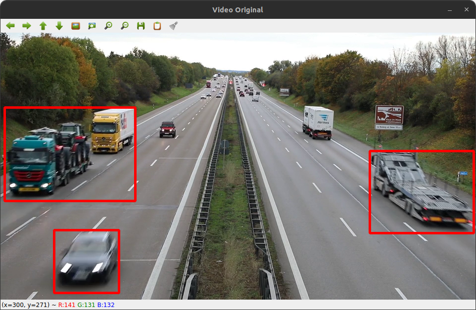

# Car Detect



[](https://www.python.org/)
[](https://opencv.org/)
[](https://numpy.org/)

## Overview

**Car Detect** is a Python project that utilizes OpenCV and NumPy libraries to detect and count cars in a given video. The project uses background subtraction techniques to identify moving vehicles and counts them as they cross a defined line in the video frame.

## Features

- **Vehicle Detection:** Identifies moving vehicles in the video.
- **Counting Vehicles:** Counts the number of vehicles passing a specific line.
- **Real-time Processing:** Processes the video frames in real-time.

## Installation

To run this project, you need to have Python 3.8+ installed on your system. Install the necessary libraries using pip:

```sh
pip install opencv-python numpy
```

## Usage

1. Clone this repository.
2. Place your video file (e.g., `video1.mp4`) in the project directory.
3. Run the script `main.py`:

```sh
python main.py
```

## Code Explanation

The main components of the code include:

- **Video Capture:** Capturing the video from the file.
- **Background Subtraction:** Using MOG (Mixture of Gaussians) for detecting moving objects.
- **Contour Detection:** Identifying the contours of detected objects.
- **Vehicle Counting:** Counting the vehicles crossing a defined line.

## Contributing

Contributions are welcome! Please create a pull request or raise an issue to discuss any changes.

## Contact

If you have any questions or feedback, feel free to contact me at [Gmail](mailto:harshabardhanaparida@gmail.com).

---
